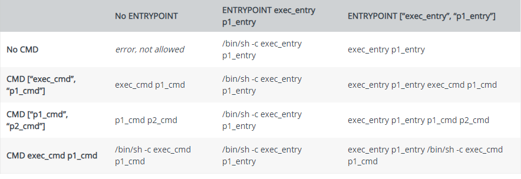

# Formation Docker

Prise de notes et exercices relatifs à la formation docker suivie lors de mon
stage de DUT.

## Manipulation des conteneurs

#### Lancer un conteneur :

    docker container run <image docker>

-ti : lancer un conteneur en mode interactif  
-t : permet l'alocation d'un pseudo tty  
-i : pour garder stdin ouvert  

-d : lancer un conteneur en arrière plan

-p host_port:container_port : permet de publier un port du conteneur sur un port
de la machine hôte (ex -p 8080:80)  
-P container_port : laisse au deamon le choix du port de la machine hôte
--name : permet de nomer le conteneur

--memory / -m <quantité><unité> : permet de limiter la consomation de mémoire du conteneur l'unité peut-être "m" ou "g"  
--cpus <number> : permet de spécifier les ressources CPU qu'un container peut utiliser.  
--cpuset-cpus : spécifie les CPUs / coeurs qu'un container peut utiliser.

--entrypoint <instructions> : permet d'écraser l'entrypoint de l'image.

*Exemples sur une machine contenant un CPU avec 8 coeurs :  
--cpuset-cpus=0-7 assure que le container utilisera les 8 coeurs (index de 0 à 7)  
--cpuset-cpus=3,4 assure que le container n'utilisera que les coeurs 4 et 5 (index 3 et 4)*

#### Arrêter un ou plusieurs conteneurs

    docker container stop <id>

    # Stop tout les conteneurs
    docker container stop $(docker ps -q)
    # Ou
    docker kill $(docker ps -q)

#### Supprimer un conteneurs

    docker container rm <id>

-f permet de forcer l'arrêt d'un conteneur actif avant de le supprimer

Arrête et supprime tout les conteners :

    docker rm -f $(docket container ls -aq)

#### Lister les conteneurs

    docker container ls

-a : affiche tout les conteneurs (même interactifs)  
-q : donne uniquement l'id
-f : permet d'ajouter des filtres. [Plus d'informations](http://www.tin.org/bin/man.cgi?section=1&topic=docker-container-ls)

Ou (deprecated)) :

    docker ps

### Inspecter un conteneur
Permet d'inspecter un conteneur, renvois les infos sous forme de fichier json

    docker container inspect <id>

--format / -f : permet d'utiliser le go format afin de filtrer les info. [Plus
d'informations](https://docs.docker.com/engine/reference/commandline/inspect/)

#### Voir les logs

    docker container logs <id>

-f : affichage en temps réel

#### Executer une commande dans un conteneur

    docker container exec [options] <id> <command>

Dans option on peut passer -ti et lancer la commande sh afin d'ouvrir un shell
interactif sur le conteneur.

#### Quitter un conteneur interactif sans le rendre interactif

Dans le conteneur presser Ctrl + p puis Ctrl + q

#### Créer une image à partir d'un container existant

    docker container commit <container name or id> <image name>

## Création d'un Docker File

[Official dockerfile reference](https://docs.docker.com/engine/reference/builder/)

#### Interaction entre entry point et cmd

#### Créer une image à partir d'un dockerfile

    docker image build -f <my_dockerfile> -t <image_name:image_tag> PATH

--no-cache : invalide le cache.

#### Dockerignore

Le fichier **.dockerignore** permet d'ignorer certain fichiers et dossiers lors
de la construction d'une image, notament lors de l'execution de l'instruction
COPY.  
Il fonctionne comme un .gitignore.

#### Afficher les images non référencées

    docker image ls --filter dangling=true

## Volumes

#### Créer un volume

    docker volume create --name <nom_du_volume>

### Monter un volume

##### À partir d'un Dockerfile
**Il est impossible de faire un bind mount à partir du Dockerfile**

    VOLUME ["<chemin_du_volume_dans_le_container"]

##### À partir de Docker CLI

    docker run --mount type=<bind | volume | tmpfs>,src=<volume_path>,dst=<container_path>

## Docker compose

[Docker voting app](https://github.com/dockersamples/example-voting-app)
